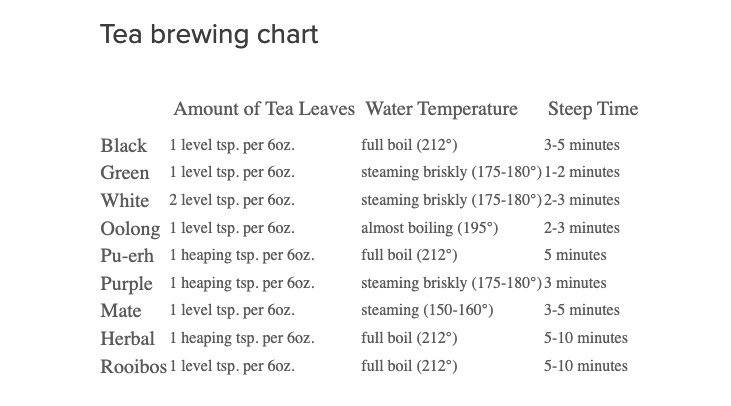
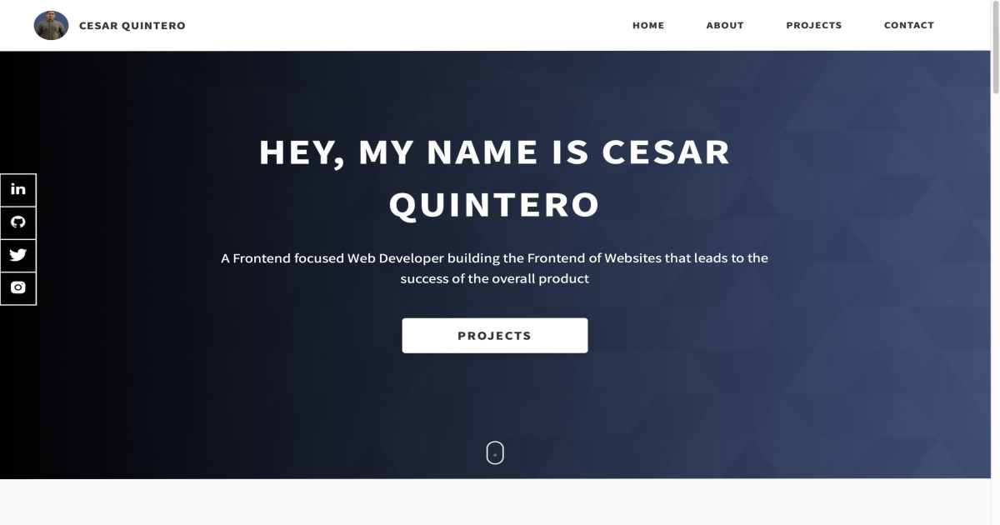
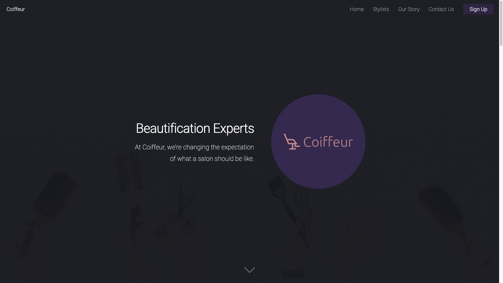
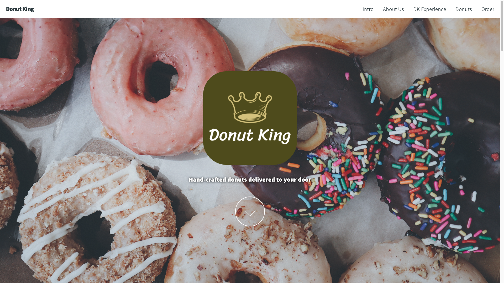

# Tea Types Api : <a target="_blank" href="https://tea-brew-api.onrender.com/">Visit Here</a>

### An API to access different types of tea brewing and steep times.

## Tech used: 

My focus was to create a simple and accessible API

## Optimizations

My next steps for improving this project would be to make it fullstack where the user will be able to simply type in a tea name and receive tea seep and brewing information using the Fetch API.

## Lessons Learned:

Learned the ins and outs of hosting servers.

## More Projects

<table bordercolor="#66b2b2">
  
  <tr>
    <td width="33.3%"  style="align:center;" valign="top">
<a target="_blank" href="https://github.com/Cesar-Quintero/Cesar-Quintero-Portfolio-Website">Portfolio Website</a>
         
      
    </td>
    <td width="33.3%" valign="top">
<a target="_blank" href="https://github.com/Cesar-Quintero/Coiffeur">Coiffeur</a>
       
        
    </td>
    <td width="33.3%" valign="top">
<a target="_blank" href="https://donutking.netlify.app/">Donut King</a>
         
        
    </td>
  </tr>
</table>